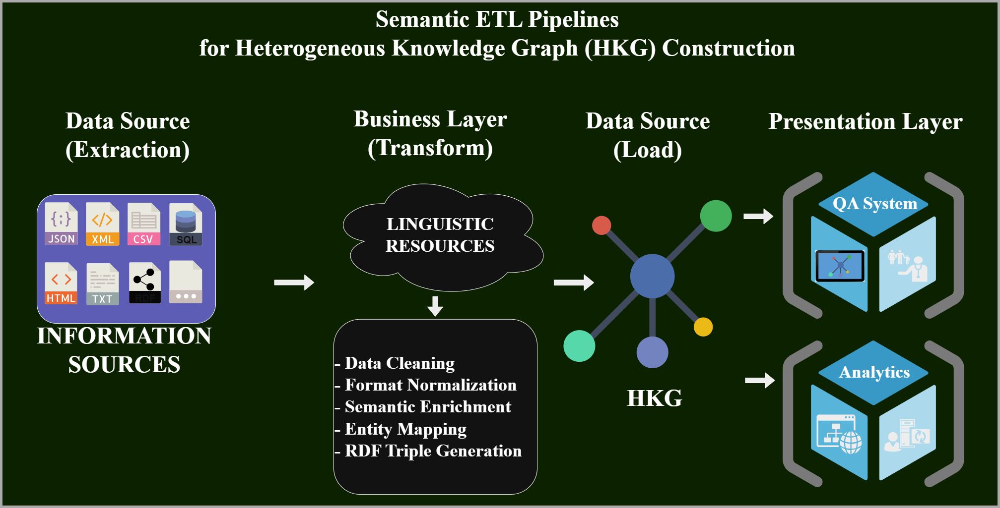
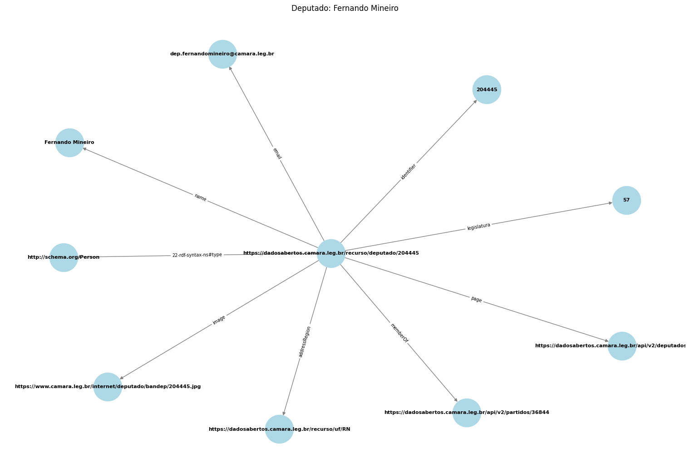

# 🧠 Semantic ETL Pipelines for Heterogeneous Knowledge Graph Construction  
### Estudo de Caso: Políticos do Brasil – Deputados Federais

---

## 📌 Visão Geral

Este projeto implementa uma pipeline **ETL Semântica (Extração, Transformação e Carga)** para a **unificação de dados heterogêneos** sobre deputados federais do Brasil. O objetivo é construir um **Grafo de Conhecimento (HKG - Heterogeneous Knowledge Graph)** que permita análises avançadas e integração semântica para sistemas de perguntas e respostas (QA Systems) e plataformas analíticas.

---

## 📊 Arquitetura do Pipeline

A estrutura segue o modelo representado abaixo:

Data Source (Extraction) → Business Layer (Transform) → Knowledge Graph (Load) → Presentation Layer




---

### 🔍 1. Camada de Extração — *Data Sources*

Integra diversas **fontes de dados heterogêneas**, como:

- JSON da API da Câmara dos Deputados  
- CSVs de bases públicas  
- Dados em XML, RDF ou HTML  
- Arquivos TXT, planilhas e outros

---

### 🛠️ 2. Camada de Transformação — *Business Layer*

Aqui ocorre o processamento semântico com apoio de **recursos linguísticos**:

- 🔹 *Data Cleaning* — limpeza e padronização dos dados
- 🔹 *Format Normalization* — conversão de formatos para RDF
- 🔹 *Semantic Enrichment* — enriquecimento com ontologias
- 🔹 *Entity Mapping* — correspondência de entidades (ex: nomes, partidos)
- 🔹 *RDF Triple Generation* — geração dos triplos semânticos

---

### 🔗 3. Camada de Carga — *Knowledge Graph (HKG)*

Após a transformação, os dados são carregados em um **grafo de conhecimento heterogêneo**, permitindo inferências, consultas SPARQL e integração com bases externas.

---

### 📈 4. Camada de Apresentação

O grafo pode ser explorado em duas frentes principais:

- **QA System** — sistema de perguntas e respostas sobre os dados políticos
- **Analytics** — visualizações, estatísticas e dashboards interativos

---

## 📁 Estrutura do Projeto

```
graph_nous/  
│  
├── dataset/               # Dados brutos e processados  
│   ├── raw/  
│   └── processed/  
│  
├── scripts/               # Scripts de extração e transformação  
│   ├── deputado_extraction.py  
│   └── ...  
│  
├── config.py              # Diretórios e paths centralizados  
├── main.py                # Ponto de entrada principal  
├── requirements.txt       # Dependências do projeto  
└── README.md              # Você está aqui :)
```


## 🚀 Como Executar

# 1. Clonar o repositório
```
git clone https://github.com/seu-usuario/graph_nous.git
cd graph_nous
```

# 2. Criar ambiente virtual

```
python -m venv venv
# (Windows) ou source venv/bin/activate (Linux/Mac)
venv\Scripts\activate  
```
# 3. Instalar dependências

```
pip install -r requirements.txt
```

# 4. Rodar o projeto

```
python main.py
```

## ▶️ Como Executar o Projeto Streamlit

Este guia apresenta os passos para rodar a interface do projeto utilizando o **Streamlit**.

### **Pré-requisitos**

- **Python 3.11+** instalado
- Dependências do projeto instaladas:
    ```bash
    pip install -r requirements.txt
    ```

- **Instale o Neo4J**

- https://neo4j.com/

- Arquivo `.env` configurado com as variáveis de ambiente necessárias

### **Passos para Execução**

1. **Navegue até o diretório do projeto**

     No terminal, acesse o diretório onde está localizado o arquivo `interface.py`:
     ```bash
     cd caminho/para/seu/projeto
     ```

2. **Execute o Streamlit**

     Inicie a aplicação com o comando:
     ```bash
     streamlit run interface.py
     ```

3. **Acesse a interface no navegador**

     O Streamlit abrirá automaticamente a interface no navegador.  
     Caso não abra, copie o link exibido no terminal (geralmente `http://localhost:8501`) e cole no navegador.

# Resultados

## Grafo - Nó Deputado



## 📚 Tecnologias Utilizadas

- **Python 3.11+**
- **Pandas**, **Requests** — para manipulação e extração de dados
- **RDFLib** *(planejado)* — para criação de triplos RDF
- **Ontologias OWL/SKOS** *(previstas)* — para enriquecimento semântico
- **GraphDB** / **Neo4j** — para armazenamento e visualização do grafo

---

## 🧪 Próximos Passos

- [ ] Integração com dados de partidos e proposições legislativas
- [ ] Normalização com identificadores globais (ex: **Wikidata**, **ORCID**)
- [ ] Geração automatizada de triplos RDF a partir de dados limpos
- [ ] Visualização e consulta semântica com **Neo4j**, **Protégé** ou **SPARQL endpoints**

---

## 👤 Autor

**Ronen Filho**  
Especialização em Inteligência Artificial Aplicada — *IFG Goiás*  
Projeto acadêmico voltado à unificação semântica de dados sobre políticos brasileiros.


